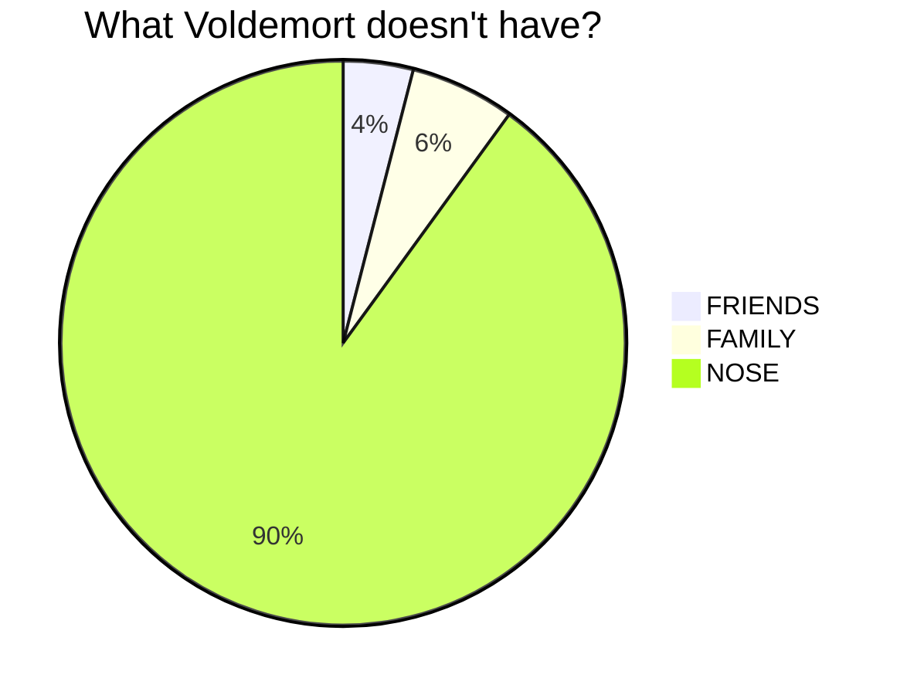

# Thapo Site

## Components and Technologies

This project uses the following components:

### Backend

Technologies:

- Java
- Markdown
- Spring Boot

### Frontend

Technologies:

- Typescript
- HTML, CSS, Markdown
- Vue.js, Vuetify

$$
a \over x
$$
