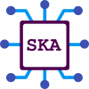

# Thapo Specific Knowledge Assistant

**Specific Knowledge Assistant** is a software system developed for the purposes of MSc "Advanced Informatics and Computing Systems - Software Development and Artificial Intelligence" of University of Piraeus. This system is utilizing custom text-generation machine learning models or pre-trained Large Language Models (LLMs) in order to assist specific knowledge discovery.

## Purpose
This website serves 4 purposes.

The 1st one is to share my public contact information and social media links.

The 2nd one is to showcase a personal Portfolio of my most important personal projects.

The 3rd one is to share some of the knowledge I've gained from my experience as a Software Engineer through a simple Blog, by writing some articles about various Software Engineering topics.

## Modules, Components and Technologies

We have develop 4 basic components for our application. The ska_llm component, which contains a library and a command line application, is implemented in python and it is responsible for all document processing and machine learning tasks. The ska_cli command line application is implemented in rust and is responsible for various administration tasks and uses the ska_llm internally to expose a more friendly command line interface for the machine learning tasks needed to be performed by the admin. The ska_server component, implemented in rust as well, exposes a REST API, which enables users to perform the various tasks of the application, like prompting the LLMs. Finally, the ska_frontend materializes the Graphical User Interface with which the users can interact with.

Apart from the four components we developed, we utilize three extra components for our complete solution. The first one is Keycloak, an open source Identity and Access Management solution which enables our users to login and to be authenticated and authorized to perform specific actions of our application. The second one is PostgreSQL, an advanced open source relational database which our application uses for storing and fetching data. The final component is an api gateway which will lay ahead of our services and redirect the web traffic to the needed service for the task.

In the following diagram, we show the fundamental Specific Knowledge Assistant (SKA) System Components. With green color we have marked the components that we develop. With burgundy color we have marked the extra components that we utilize and configure them in order to complete our system.

### ska_llm

The ska_llm component is implemented in python and it is responsible for all document processing and machine learning tasks. It supports five crucial for our application Development of an AIBased System for Knowledge Specific Assistance operations which are using the libraries we described in Section 2.3.

Technologies:
- Python
- NLTK
- Langchain
- PyTorch
- Hugging Face Hub
- matplotlib
- unstructured
- FAISS

### ska_cli
The ska_cli command line application is implemented in rust and it is responsible for various administration tasks and it uses the ska_llm internally. This cli component exposes a friendly command line interface so that the admin can perform various operations. For the command line interface and argument parsing we will depend on clap library. For all database access we depend on the SeaORM library.

Technologies:
- Rust
- clap
- tokio
- SeaORM

### ska_server

The ska_server component is implemented in rust, it exposes a REST API with some http endpoints which will be called by the ska_frontend component. It uses the same code base as the ska_cli component in order to have consistent business logic and be able to share domain relevant modules like entities and repos . For the http api construction we depend on the axum library. All the http endpoints are protected and need an authenticated user with required permissions for allowed access.

Technologies:
- Rust
- tokio
- SeaORM
- axum

### ska_frontend
The ska_frontend component materializes the Graphical User Interface with which the users can interact with. It actually consists of two sub components. The first one is ska_frontend client which contains all the built and bundled final needed files like html, css, javascript, images, etc. The second sub component ska_frontend static server is a simple http server, implemented by using a simply configured nginx instance, which serves all the files needed for the ska_frontend client to run in the users’ browsers. The ska_frontend client is what we call a Single Page Application (SPA) [46] so the pages can contain complex logic in the client side and dynamically change their content without fetching new complete html pages from a server for any single request. The implementation is based on the Vue.js library

Technologies:
- TypeScript
- HTML
- CSS
- Vue.js
- nginx

### keycloak
The keycloak component is used as a user pool and as a user authentication and authorization utility. For this we have created a specific SKA Realm which contains the available users together with their assigned roles.

### PostgreSQL database

The PostgreSQL database is used in order to persist users’ data. Specifically we use the table users to store each user who logs in to our application. We update their details in each login. Each user can have multiple chats which we store to table user_chat . Each chat can have multiple messages some of them are “ANSWER” type and some of them are “QUESTION” type. We store the messages to table chat_message .

### api gateway
The api gateway is implemented by either using a nginx reverse proxy or a kubernetes Ingress [77] depending on the deployment method. All the incoming http requests reach this component at first and then they get redirected to the desired service. This enables us to have a single component which can be configured with rules. Additionally, we have the benefit to serve the whole application under a single owned domain name and redirect the traffic based on http paths.

### Deployment
Deployment of all components can done by either using Docker/Podman or Kubernetes.
